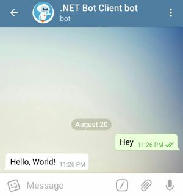

# Sending Messages

There are many different types of message that a bot can send.
Fortunately, methods for sending such messages are similar. Take a look at these examples:

## Sending text message



```c#
Message message = await botClient.SendTextMessageAsync(
    chatId: chatId,
    text:   "Hello, World!",
    cancellationToken: cancellationToken);
```

## Sending sticker message


```c#
Message message = await botClient.SendStickerAsync(
    chatId:  chatId,
    sticker: "https://github.com/TelegramBots/book/raw/master/src/docs/sticker-dali.webp",
    cancellationToken: cancellationToken);
```

## Sending video message


```c#
Message message = await botClient.SendVideoAsync(
    chatId:  chatId,
    video: "https://github.com/TelegramBots/book/raw/master/src/docs/video-bulb.mp4",
    cancellationToken: cancellationToken);
```
