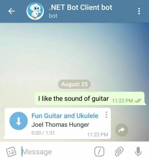
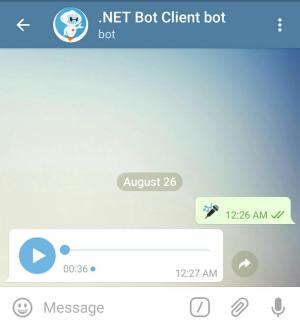

# Audio and Voice Messages

[](https://github.com/TelegramBots/Telegram.Bot/blob/master/test/Telegram.Bot.Tests.Integ/Sending%20Messages/AudioMessageTests.cs)

These two types of messages are pretty similar. An audio is in MP3 format and gets displayed in music player.
A voice file has OGG format and is not shown in music player.

## Audio

[](https://core.telegram.org/bots/api#sendaudio)

This is the code to send an MP3 soundtrack. You might be wondering why some parameters are commented out.
That's because this MP3 file has metadata on it and Telegram does a good job at reading them.

```c#
Message message = await botClient.SendAudioAsync(
    chatId: chatId,
    audio: "https://github.com/TelegramBots/book/raw/master/src/docs/audio-guitar.mp3",
    /*
    performer: "Joel Thomas Hunger",
    title: "Fun Guitar and Ukulele",
    duration: 91, // in seconds
    */
    cancellationToken: cancellationToken);
```



And a user can see the audio in Music Player:


Method returns an audio message. Let's take a look at the value of `msg.Audio` property in JSON format:

```json
{
  "duration": 91,
  "mime_type": "audio/mpeg",
  "title": "Fun Guitar and Ukulele",
  "performer": "Joel Thomas Hunger",
  "file_id": "CQADBAADKQADA3oUUKalqDOOcqesAg",
  "file_size": 1102154
}
```

## Voice

[](https://core.telegram.org/bots/api#sendvoice)

A voice message is just an OGG audio file.
Let's send it differently this time by uploading the file from disk alongside with an HTTP request.

To run this example, download the [NFL Commentary voice file] to your disk.

A value is passed for `duration` because Telegram can't figure that out from a file's metadata.

> ⚠️ Replace ```/path/to/voice-nfl_commentary.ogg``` with an actual file

```c#
Message message;
using (var stream = System.IO.File.OpenRead("/path/to/voice-nfl_commentary.ogg")) {
    message = await botClient.SendVoiceAsync(
        chatId: chatId,
        voice: stream,
        duration: 36,
        cancellationToken: cancellationToken);
}
```



A voice message is returned from the method. Inspect the `msg.Voice` property to learn more.

[NFL Commentary voice file]: https://raw.githubusercontent.com/TelegramBots/book/master/src/docs/voice-nfl_commentary.ogg
