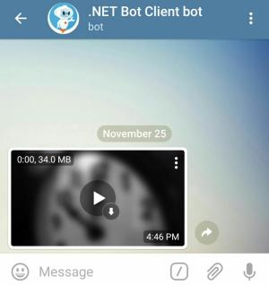
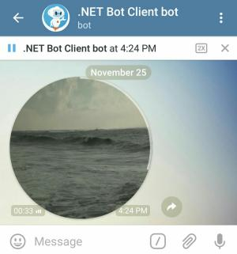

# Media Messages

There are different types of media messages that a bot can send (photos, videos, documents...).
Fortunately, methods for sending such messages are similar (see sections below for examples)

But let's first see what they have in common.

## Providing the source file

You can provide the file data in 3 ways:
- Using the Internet URL to the file (must point to the actual file, not a webpage)
- Uploading the file data as a stream
- Using the `FileId` of a file that was already sent over Telegram (ex: `msg.Video.FileId`, `msg.Photo[^1].FileId`...)

Examples in this section show all three.
You will learn more about them later on when we discuss file [upload](../../3/files/upload.md) and [download](../../3/files/download.md).

## Providing the caption

Media messages can _optionally_ have a text attached to them (called "Caption").

[Similar to text message](README.md), the caption can have text effects (specifying `ParseMode.HTML` or `Markdown`, or manual captionEntities)

The Message object returned by the Send* method will have:
- `message.Caption`: caption in plain text without effects
- `message.CaptionEntities`: list of [text effects](https://core.telegram.org/bots/api#messageentity) to be apply to the plain text
- `message.CaptionEntityValues`: caption text parts covered by these entities

You can use our extension methods `message.ToHtml()` or `message.ToMarkdown()` to convert the caption & entities back into HTML **(recommended)** or Markdown.


## Photo

[](https://core.telegram.org/bots/api#sendphoto)
[](https://github.com/TelegramBots/Telegram.Bot/blob/master/test/Telegram.Bot.Tests.Integ/Sending%20Messages/SendingPhotoMessageTests.cs)

Sending a photo is simple. Here is an example:

```csharp
var message = await bot.SendPhoto(chatId, "https://telegrambots.github.io/book/docs/photo-ara.jpg",
    "<b>Ara bird</b>. <i>Source</i>: <a href=\"https://pixabay.com\">Pixabay</a>", ParseMode.Html);
```


Here we sent a caption in HTML format. The user can click on <u>[Pixabay](https://pixabay.com)</u> in the caption to open its URL in the browser.

The `Message` returned by the SendPhoto method represents a _photo message_ because `message.Photo` has a value.
Its value is an array with each  [PhotoSize](https://core.telegram.org/bots/api#photosize) representing the same photo in different resolutions, with the largest dimensions last.


## Sticker

[](https://core.telegram.org/bots/api#sendsticker)
[](https://github.com/TelegramBots/Telegram.Bot/blob/master/test/Telegram.Bot.Tests.Integ/Stickers/StickersTests.cs)

Telegram stickers are fun. They can be static (PNG or [WebP](https://developers.google.com/speed/webp/) format), [animated or video](https://core.telegram.org/stickers) stickers

This code sends the same sticker twice. First by passing an URL to a WebP sticker file
and second by reusing `FileId` of the same sticker on Telegram servers.

```csharp
var message1 = await bot.SendSticker(chatId, "https://telegrambots.github.io/book/docs/sticker-fred.webp");
var message2 = await bot.SendSticker(chatId, message1.Sticker!.FileId);
```


## Video

[](https://core.telegram.org/bots/api#sendvideo)
[](https://github.com/TelegramBots/Telegram.Bot/blob/master/test/Telegram.Bot.Tests.Integ/Sending%20Messages/VideoMessageTests.cs)

You can send video via MP4 files (other formats may not be supported natively by Telegram clients and can be sent as Document)

Here is a simple example:

```csharp
await bot.SendVideo(chatId, "https://telegrambots.github.io/book/docs/video-hawk.mp4");
```


Videos, like other multimedia messages, can have caption, reply, reply markup, and etc.
You can optionally specify the duration and resolution of the video.

In the example below, we send a video of a 10 minute countdown
and expect the Telegram clients to stream that long video instead of downloading it completely.
We also set a thumbnail image for our video.

```csharp
await bot.SendVideo(chatId, "https://telegrambots.github.io/book/docs/video-countdown.mp4",
    thumbnail: "https://telegrambots.github.io/book/2/docs/thumb-clock.jpg", supportsStreaming: true);
```



User should be able to seek through the video without the video being downloaded completely.


## Audio

[](https://core.telegram.org/bots/api#sendaudio)
[](https://github.com/TelegramBots/Telegram.Bot/blob/master/test/Telegram.Bot.Tests.Integ/Sending%20Messages/AudioMessageTests.cs)

Here is the code to send an MP3 soundtrack.

```csharp
var message = await bot.SendAudio(chatId, "https://telegrambots.github.io/book/docs/audio-guitar.mp3"
    //  , performer: "Joel Thomas Hunger", title: "Fun Guitar and Ukulele", duration: 91    // optional
    );
```

You might be wondering why some parameters are commented out?
That's because this MP3 file has metadata on it and Telegram does a good job at reading it.


The method returns an audio Message with the metadata associated with the audio (ex: `msg.Audio.Performer`, `msg.Audio.Duration`...)


## Voice

[](https://core.telegram.org/bots/api#sendvoice)

A voice message is similar to audio but has OGG format and is not shown in music player.
Let's send it differently this time by uploading the file from disk.

To run this example, download the [NFL Commentary voice file](https://telegrambots.github.io/book/docs/voice-nfl_commentary.ogg) to your disk.

A value is passed for `duration` because Telegram can't figure that out from a file's metadata.

> ⚠️ Replace ```/path/to/voice-nfl_commentary.ogg``` with an actual file path.

```csharp
await using Stream stream = File.OpenRead("/path/to/voice-nfl_commentary.ogg");
var message = await bot.SendVoice(chatId, stream, duration: 36);
```


A voice message is returned from the method. Inspect the `message.Voice` properties to learn more.


## Video Note

[](https://core.telegram.org/bots/api#sendvideonote)

Sending video notes is similar to video, but they are shown in circles to the user, usually short (1 minute or less) with identical width and height.

Note: Sending video note via an URL is not supported currently.

Download the [Sea Waves video](https://telegrambots.github.io/book/docs/video-waves.mp4) to your disk for this example.

```csharp
await using Stream stream = File.OpenRead("/path/to/video-waves.mp4");

await bot.SendVideoNote(chatId, stream,
    duration: 47, length: 360); // value of width/height
```



## Document (files)

[](https://core.telegram.org/bots/api#senddocument)
[](https://github.com/TelegramBots/Telegram.Bot/blob/master/test/Telegram.Bot.Tests.Integ/Sending%20Messages/DocumentMessageTests.cs)

Use [`SendDocument`](https://core.telegram.org/bots/api#senddocument) method to send general files.

```csharp
await bot.SendDocument(chatId, "https://telegrambots.github.io/book/docs/photo-ara.jpg",
    "<b>Ara bird</b>. <i>Source</i>: <a href=\"https://pixabay.com\">Pixabay</a>", ParseMode.Html);
```

Using `SendDocument` to send a photo or video ensure that the file data is unchanged (not recompressed and metadata are preserved)

## Animation (GIF or gifv)

[](https://core.telegram.org/bots/api#sendanimation)
[](https://github.com/TelegramBots/Telegram.Bot/blob/master/test/Telegram.Bot.Tests.Integ/Sending%20Messages/AnimationMessageTests.cs)

Use [`SendAnimation`](https://core.telegram.org/bots/api#sendanimation) method to send animation files (GIF or H.264/MPEG-4 AVC video without sound).

```csharp
await bot.SendAnimation(chatId, "https://telegrambots.github.io/book/docs/video-waves.mp4", "Waves");
```


# Media group (album of multiple media)

[](https://core.telegram.org/bots/api#sendmediagroup)
[](https://github.com/TelegramBots/Telegram.Bot/blob/master/test/Telegram.Bot.Tests.Integ/Sending%20Messages/AlbumMessageTests.cs)

Using [`SendMediaGroup`](https://core.telegram.org/bots/api#sendmediagroup) method you can send a group of photos, videos, documents or audios as an album. Documents and audio files can be only grouped in an album with messages of the same type.

```csharp
var messages = await bot.SendMediaGroup(chatId, new IAlbumInputMedia[]
    {
        new InputMediaPhoto("https://cdn.pixabay.com/photo/2017/06/20/19/22/fuchs-2424369_640.jpg"),
        new InputMediaPhoto("https://cdn.pixabay.com/photo/2017/04/11/21/34/giraffe-2222908_640.jpg"),
    });
```

Note that media groups can't have reply markup. The caption must be set an one of the media (usually the first)

<!-- -------------- -->

[`Message`]: https://core.telegram.org/bots/api#message
[`PhotoSize`]: https://core.telegram.org/bots/api#photosize
[`Sticker`]: https://core.telegram.org/bots/api#sticker
