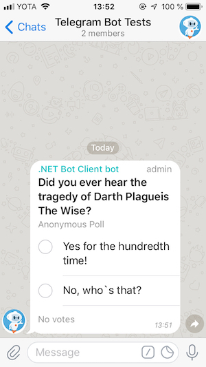
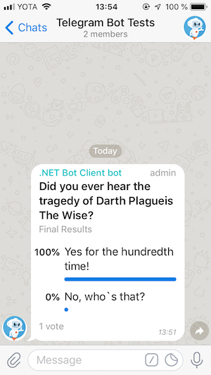

# Native Poll Messages

[](https://github.com/TelegramBots/Telegram.Bot/blob/master/test/Telegram.Bot.Tests.Integ/Polls/AnonymousPollTests.cs)

Bots just as regular users can send native polls only to groups and channels, but not to private chats.

## Send a poll

[](https://core.telegram.org/bots/api#sendpoll)

This is the code to send a poll to a chat.

```c#
Message pollMessage = await botClient.SendPollAsync(
    chatId: "@group_or_channel_username",
    question: "Did you ever hear the tragedy of Darth Plagueis The Wise?",
    options: new []
    {
        "Yes for the hundredth time!",
        "No, who`s that?"
    },
    cancellationToken: cancellationToken);
```



You can optionally send a keyboard with a poll, both an inline and a regular one.

You'll get the message with [`Poll`](https://github.com/TelegramBots/Telegram.Bot/blob/master/src/Telegram.Bot/Types/Poll.cs) object inside it.

## Stop a poll

[](https://core.telegram.org/bots/api#stoppoll)

To close a poll you need to know original chat and message ids of the poll that you got from calling `SendPollAsync` method.

Let's close the poll that we sent in the previous example:

```c#
Poll poll = await botClient.StopPollAsync(
    chatId: pollMessage.Chat.Id,
    messageId: pollMessage.MessageId,
    cancellationToken: cancellationToken);
```



You can also send a new inline keyboard when you close a poll.

As a result of the request you'll get the the final poll state with property `Poll.IsClosed` set to true.

If you'll try to close a forwarded poll using message and chat ids from the received message even if your bot is the author of the poll you'll get an `ApiRequestException` with message `Bad Request: poll can't be stopped`. Polls originated from channels is an exception since forwarded messages originated from channels contain original chat and message ids inside properties `Message.ForwardFromChat.Id` and `Message.ForwardFromMessageId`.

Also if you'll try to close an already closed poll you'll get `ApiRequestException` with message `Bad Request: poll has already been closed`.
