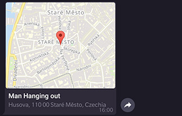
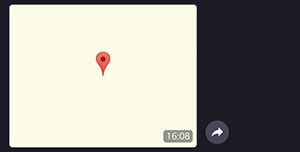

# Other Messages

There are other kind of message types which are supported by the client. In the following paragraphs we will look how to send contacts, venues or locations.

## Contact

This is the code to send a contact. Mandatory are the parameters `chatId`, `phoneNumber` and `firstName`.

Beware the parameter `disableNotification` behaves diffrently according to the recivers operating system. iOS users will not receive a notification, Android users will receive a notification with no sound.

```c#
Message msg = await botClient.SendContactAsync(
    chatId: e.Message.Chat.Id,
    phoneNumber: "+1234567890",
    firstName: "Han",
    lastName: "Solo",
    disableNotification: true,
);
```


If you want to send a contact as vCard you can achieve  this by adding a valid vCard `string` as value for the optional parameter `vCard` as seen in the given example below. 

```c#
Message msg = await botClient.SendContactAsync(
    chatId: e.Message.Chat.Id,
    phoneNumber: "+1234567890",
    firstName: "Han",
    vCard: "BEGIN:VCARD\n" +
            "VERSION:3.0\n" +
            "N:Solo;Han\n" +
            "ORG:Scruffy-looking nerf herder\n" +
            "TEL;TYPE=voice,work,pref:+1234567890\n" +
            "EMAIL:hansolo@mfalcon.com\n" +
            "END:VCARD"
);
```


## Venue

The code snippet below sends a venue with a title and a address as given parameters:

```c#
Message msg = await botClient.SendVenueAsync(
    chatId: e.Message.Chat.Id,
    latitude: 50.0840172f,
    longitude: 14.418288f,
    title: "Man Hanging out",
    address: "Husova, 110 00 Staré Město, Czechia"
);
```



## Location

The difference between sending a location and a venue is, that the venue requires a title and address. A location can be any given point as latitude and longitude.

The following snippet shows how to send a location with the mandatory parameters:

```c#
Message message = await botClient.SendLocationAsync(
    chatId: e.Message.Chat.Id,
    latitude: 33.747252f,
    longitude: -112.633853f
);
```


