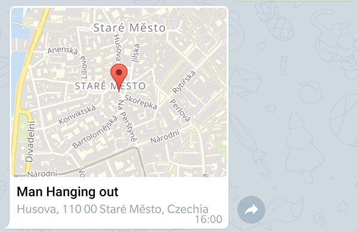
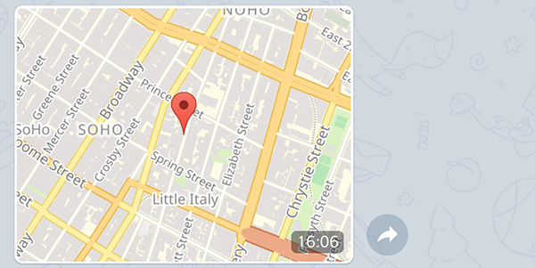

# Other Messages

There are other kind of message types which are supported by the client. In the following paragraphs we will look how to send contacts, venues or locations.

## Contact

[](https://core.telegram.org/bots/api#sendcontact)
[](https://github.com/TelegramBots/Telegram.Bot/blob/master/test/Telegram.Bot.Tests.Integ/Sending%20Messages/SendingContactMessageTests.cs)

This is the code to send a contact. Mandatory are the parameters `chatId`, `phoneNumber` and `firstName`.

```c#
Message message = await botClient.SendContactAsync(
    chatId: chatId,
    phoneNumber: "+1234567890",
    firstName: "Han",
    lastName: "Solo",
    cancellationToken: cancellationToken);
```


If you want to send a contact as vCard you can achieve  this by adding a valid vCard `string` as value for the optional parameter `vCard` as seen in the given example below.

```c#
Message message = await botClient.SendContactAsync(
    chatId: chatId,
    phoneNumber: "+1234567890",
    firstName: "Han",
    vCard: "BEGIN:VCARD\n" +
           "VERSION:3.0\n" +
           "N:Solo;Han\n" +
           "ORG:Scruffy-looking nerf herder\n" +
           "TEL;TYPE=voice,work,pref:+1234567890\n" +
           "EMAIL:hansolo@mfalcon.com\n" +
           "END:VCARD",
    cancellationToken: cancellationToken);
```


## Venue

[](https://core.telegram.org/bots/api#sendvenue)
[](https://github.com/TelegramBots/Telegram.Bot/blob/master/test/Telegram.Bot.Tests.Integ/Sending%20Messages/SendingVenueMessageTests.cs)

The code snippet below sends a venue with a title and a address as given parameters:

```c#
Message message = await botClient.SendVenueAsync(
    chatId: chatId,
    latitude: 50.0840172f,
    longitude: 14.418288f,
    title: "Man Hanging out",
    address: "Husova, 110 00 Staré Město, Czechia",
    cancellationToken: cancellationToken);
```



## Location

[](https://core.telegram.org/bots/api#sendlocation)
[](https://github.com/TelegramBots/Telegram.Bot/blob/master/test/Telegram.Bot.Tests.Integ/Sending%20Messages/SendingVenueMessageTests.cs)

The difference between sending a location and a venue is, that the venue requires a title and address. A location can be any given point as latitude and longitude.

The following snippet shows how to send a location with the mandatory parameters:

```c#
Message message = await botClient.SendLocationAsync(
    chatId: chatId,
    latitude: 33.747252f,
    longitude: -112.633853f,
    cancellationToken: cancellationToken);
```


