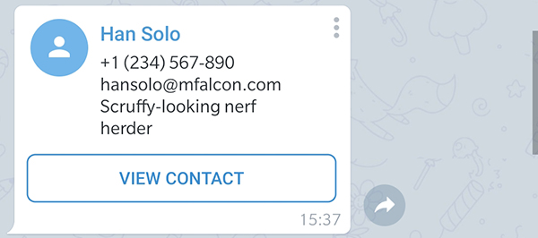

# Other Messages

There are other kind of message types which are supported by the client.

## Contact

This is the code to send a contact. Mandatory are the parameters `chatId`, `phoneNumber` and `firstName`.

Beware the parameter `disableNotification` behaves diffrently according to the recivers operating system. iOS users will not receive a notification, Android users will receive a notification with no sound.

```c#
Message msg = await botClient.SendContactAsync(
    chatId: e.Message.Chat.Id,
    phoneNumber: "+1234567890",
    firstName: "Han",
    lastName: "Solo",
    disableNotification: true,
);
```


If you want to send a contact as vCard you can achieve  this by adding a valid vCard `string` as value for the optional parameter `vCard` as seen in the given example below. 

```c#
Message msg = await botClient.SendContactAsync(
    chatId: e.Message.Chat.Id,
    phoneNumber: "+1234567890",
    firstName: "Han",
    vCard: "BEGIN:VCARD\n" +
            "VERSION:3.0\n" +
            "N:Solo;Han\n" +
            "ORG:Scruffy-looking nerf herder\n" +
            "TEL;TYPE=voice,work,pref:+1234567890\n" +
            "EMAIL:hansolo@mfalcon.com\n" +
            "END:VCARD"
);
```



## Venue

## Location