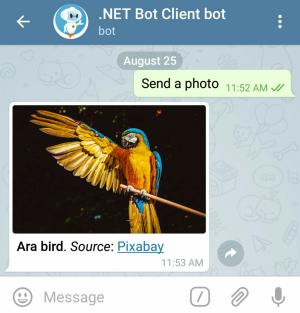

# Photo and Sticker Messages

You can provide the source file for almost all multimedia messages (e.g. photo, video) in 3 ways:

- Uploading a file with the HTTP request
- HTTP URL for Telegram to get a file from the internet
- `file_id` of an existing file on Telegram servers (_recommended_)

Examples in this section show all three.
You will learn more about them later on when we discuss file upload and download.

## Photo

[](https://core.telegram.org/bots/api#sendphoto)
[](https://github.com/TelegramBots/Telegram.Bot/blob/master/test/Telegram.Bot.Tests.Integ/Sending%20Messages/SendingPhotoMessageTests.cs)

Sending a photo is simple. Here is an example:

```c#
Message message = await botClient.SendPhotoAsync(
    chatId: chatId,
    photo: "https://github.com/TelegramBots/book/raw/master/src/docs/photo-ara.jpg",
    caption: "<b>Ara bird</b>. <i>Source</i>: <a href=\"https://pixabay.com\">Pixabay</a>",
    parseMode: ParseMode.Html,
    cancellationToken: cancellationToken);
```



### Caption

Multimedia messages can _optionally_ have a caption attached to them. Here we sent a caption in HTML format.
A user can click on _Pixabay_ in the caption to open its URL in the browser.

Similar to message entities discussed before, caption entities on [`Message`] object are the result of
parsing formatted(Markdown or HTML) caption text.
Try inspecting these properties in debug mode:

- `message.Caption`: caption in plain text without formatting
- `message.CaptionEntities`: info about special entities in the caption
- `message.CaptionEntityValues`: text values of mentioned entities

### Photo Message

The `message` returned from this method represents a _photo message_ because `message.Photo` has a value.
Its value is a [`PhotoSize`] array with each element representing the same photo in different dimensions.
If your bot needs to send this photo again at some point, it is recommended to store this array
so you can reuse the `file_id` value.

Here is how `message.Photo` array looks like in JSON:

```json
[
  {
    "file_id": "AgADBAADDqgxG-QDDVCm5JVvld7MN0z6kBkABCQawlb-dBXqBZUEAAEC",
    "file_size": 1254,
    "width": 90,
    "height": 60
  },
  {
    "file_id": "AgADBAADDqgxG-QDDVCm5JVvld7MN0z6kBkABAKByRnc22RmBpUEAAEC",
    "file_size": 16419,
    "width": 320,
    "height": 213
  },
  {
    "file_id": "AgADBAADDqgxG-QDDVCm5JVvld7MN0z6kBkABHezqGiNOz9yB5UEAAEC",
    "file_size": 57865,
    "width": 640,
    "height": 426
  }
]
```

## Sticker

[](https://core.telegram.org/bots/api#sendsticker)
[](https://github.com/TelegramBots/Telegram.Bot/blob/master/test/Telegram.Bot.Tests.Integ/Stickers/StickersTests.cs)

Telegram stickers are fun and our bot is about to send its very first sticker.
Sticker files should be in [WebP] format.

This code sends the same sticker twice. First by passing HTTP URL to a [WebP] sticker file and
second by reusing `file_id` of the same sticker on Telegram servers.

```c#
Message message1 = await botClient.SendStickerAsync(
    chatId: chatId,
    sticker: "https://github.com/TelegramBots/book/raw/master/src/docs/sticker-fred.webp",
    cancellationToken: cancellationToken);

Message message2 = await botClient.SendStickerAsync(
    chatId: chatId,
    sticker: message1.Sticker.FileId,
    cancellationToken: cancellationToken);
```


Try inspecting the `msg1.Sticker` property. It is of type [`Sticker`] and its schema looks similar to a photo.

> There is more to stickers and we will talk about them in greater details later.

<!-- -------------- -->

[`Message`]: https://core.telegram.org/bots/api#message
[`PhotoSize`]: https://core.telegram.org/bots/api#photosize
[WebP]: https://developers.google.com/speed/webp/
[`Sticker`]: https://core.telegram.org/bots/api#sticker
