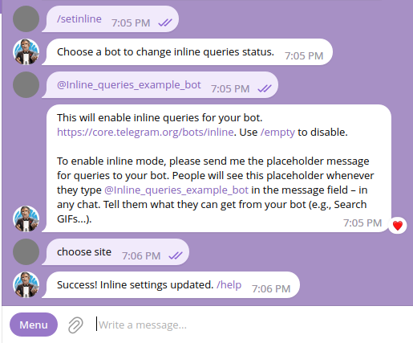
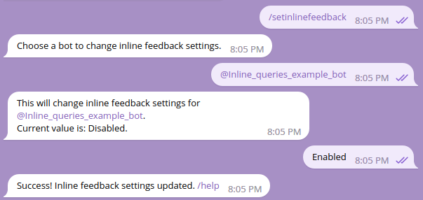
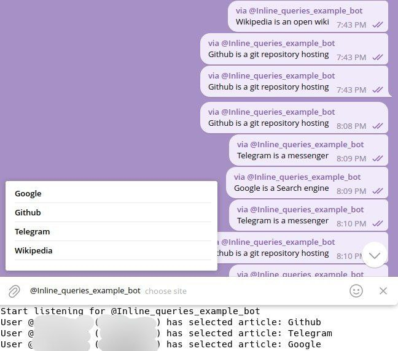

# Inline Mode

[](https://core.telegram.org/bots/api#inline-mode)
[](https://github.com/TelegramBots/Telegram.Bot.Examples/blob/master/Telegram.Bot.Examples.InlineQueries/Program.cs)

Telegram bots can be queried directly in the chat or via inline queries.

To use inline queries in your bot, you need to set up inline mode by command:



Import `Telegram.Bot.Types.InlineQueryResults` namespace for inline query types.

There are two types that allow you to work with inline queries - `InlineQuery` and `ChosenInlineResult`:

```c#
{{#include ../../Examples/3/Inline.cs:switch-statement}}
```

## `InlineQuery`

[](https://core.telegram.org/bots/api#inlinequeryresult)

Suppose we have two arrays:

```c#
{{#include ../../Examples/3/Inline.cs:arrays}}
```

So we can handle inline queries this way:

```c#
{{#include ../../Examples/3/Inline.cs:on-inline-query-received}}
```

`InlineQueryResult` is an abstract type used to create a response for inline queries. You can use these result types for inline queries: `InlineQueryResultArticle` for articles, `InlineQueryResultPhoto` for photos, etc.

## `ChosenInlineResult`

[](https://core.telegram.org/bots/api#choseninlineresult)

This type helps to handle chosen inline result. For example, you may want to know which result users chose:

```csharp
{{#include ../../Examples/3/Inline.cs:on-chosen-inline-result-received}}
```

To use the feature you need to enable "inline feedback" in BotFather by `/setinlinefeedback` command:



Final result:

