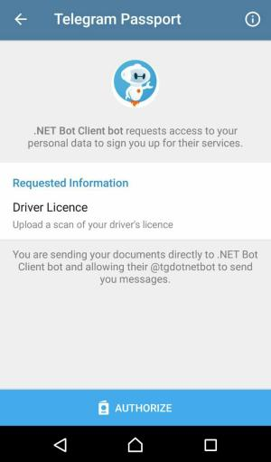
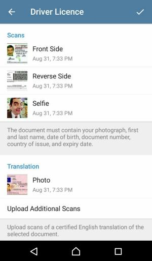
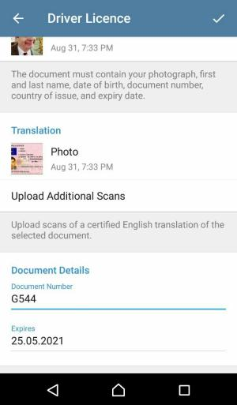

# Passport Files and Documents

[](https://github.com/TelegramBots/Telegram.Bot.Extensions.Passport/blob/master/test/IntegrationTests/Single%20Scope%20Requests/Driver%20License%20Tests.cs)

We use the driver's license scope here to show decryption of _ID document data_ and _passport files_ for
front side scan, reverse side scan, selfie photo, and translation scan.
That should cover most of the [field types in Telegram Passport].

Sections below are referring to the test methods in [Driver's License Scope Tests] collection.
Here are the steps:

1. [Authorization Request](#authorization-request)
1. [Driver's License Info](#drivers-license-info)
1. [Passport Message](#passport-message)
1. [Credentials](#credentials)
1. [ID Document Data](#id-document-data)
1. [Passport File](#passport-file)
    - [Front Side File](#front-side-file)
    - [Reverse Side File](#reverse-side-file)
    - [Selfie File](#selfie-file)
    - [Translation File](#translation-file)

## Authorization Request

[](https://core.telegram.org/passport#passportscope)
[](https://core.telegram.org/passport#passportscopeelementone)

[](https://github.com/TelegramBots/Telegram.Bot.Extensions.Passport/blob/master/test/IntegrationTests/Single%20Scope%20Requests/Driver%20License%20Tests.cs)

We start by generating an authorization URI.
Since a driver's license is considered as a proof of identity, we ask for optional data _selfie with document_ and
_translation document scan_ as well.


## Driver's License Info

As a user, provide information for the required fields: front side, reverse side, and document number.
Also, test methods here expect a selfie photo and a file for translation scan.





Click the _Authorize_ button at the end.

## Passport Message

[](https://core.telegram.org/bots/api#passportdata)

[](https://github.com/TelegramBots/Telegram.Bot.Extensions.Passport/blob/master/test/IntegrationTests/Single%20Scope%20Requests/Driver%20License%20Tests.cs)

This test method checks for a Passport message with a driver's license element on it.

## Credentials

[](https://core.telegram.org/bots/api#encryptedcredentials)
[](https://core.telegram.org/passport#credentials)

[](https://github.com/TelegramBots/Telegram.Bot.Extensions.Passport/blob/master/test/IntegrationTests/Single%20Scope%20Requests/Driver%20License%20Tests.cs)

We decrypt credentials using the RSA private key and verify that the same nonce is used.

```c#
RSA key = EncryptionKey.ReadAsRsa();
IDecrypter decrypter = new Decrypter();
Credentials credentials = decrypter.DecryptCredentials(
    passportData.Credentials,
    key
);
bool isSameNonce = credentials.Nonce == "Test nonce for driver's license";
```

## ID Document Data

[](https://core.telegram.org/passport#iddocumentdata)

[](https://github.com/TelegramBots/Telegram.Bot.Extensions.Passport/blob/master/test/IntegrationTests/Single%20Scope%20Requests/Driver%20License%20Tests.cs)

In our test case, there is only 1 item in the `message.passport_data.data` array and that's the encrypted element for
the driver's license scope.
We can get information such as document number and expiry date for the license from that element:

```c#
IdDocumentData licenseDoc = decrypter.DecryptData<IdDocumentData>(
    encryptedData: element.Data,
    dataCredentials: credentials.SecureData.DriverLicense.Data
);
```

## Passport File

[](https://core.telegram.org/bots/api#passportfile)
[](https://core.telegram.org/passport#filecredentials)

Passport file is an encrypted JPEG file on Telegram servers.
You need to download the passport file and decrypt it using its accompanying _file credentials_ to see
the actual JPEG file content.
In this section we try to demonstrate different use cases that you might have for such files.

No matter the method used, the underlying decryption logic is the same.
It really comes down to your decision on working with _streams_ vs. _byte arrays_.
[IDecrypter] gives you both options.

### Front Side File

[](https://github.com/TelegramBots/Telegram.Bot.Extensions.Passport/blob/master/test/IntegrationTests/Single%20Scope%20Requests/Driver%20License%20Tests.cs)

A pretty handy extension method is used here to stream writing the front side file to disk.
Method [DownloadAndDecryptPassportFileAsync] does a few things:

1. Makes an HTTP request to fetch the encrypted file's info using its _passport file\_id_
1. Makes an HTTP request to download the encrypted file using its _file\_path_
1. Decrypts the encrypted file
1. Writes the actual content to the destination stream

```c#
File encryptedFileInfo;
using (System.IO.Stream stream = System.IO.File.OpenWrite("/path/to/front-side.jpg"))
{
    encryptedFileInfo = await BotClient.DownloadAndDecryptPassportFileAsync(
        element.FrontSide, // PassportFile object for front side
        credentials.SecureData.DriverLicense.FrontSide, // front side FileCredentials
        stream // destination stream for writing the JPEG content to
    );
}
```

> **Warning**: This method is convenient to use but gives you the least amount of control over the operations.

### Reverse Side File

[](https://github.com/TelegramBots/Telegram.Bot.Extensions.Passport/blob/master/test/IntegrationTests/Single%20Scope%20Requests/Driver%20License%20Tests.cs)

Previous method call is divided into two operations here for reverse side of the license.
Streams are used here as well.

```c#
File encryptedFileInfo;
using (System.IO.Stream
    encryptedContent = new System.IO.MemoryStream(element.ReverseSide.FileSize),
    decryptedFile = System.IO.File.OpenWrite("/path/to/reverse-side.jpg")
) {
    // fetch the encrypted file info and download it to memory
    encryptedFileInfo = await BotClient.GetInfoAndDownloadFileAsync(
        element.ReverseSide.FileId, // file_id of passport file for reverse side
        encryptedContent // stream to copy the encrypted file into
    );
    // ensure memory stream is at the beginning before reading from it
    encryptedContent.Position = 0;

    // decrypt the file and write it to disk
    await decrypter.DecryptFileAsync(
        encryptedContent,
        credentials.SecureData.DriverLicense.ReverseSide, // reverse side FileCredentials
        decryptedFile // destination stream for writing the JPEG content to
    );
}
```

### Selfie File

[](https://github.com/TelegramBots/Telegram.Bot.Extensions.Passport/blob/master/test/IntegrationTests/Single%20Scope%20Requests/Driver%20License%20Tests.cs)

We deal with selfie photo as a byte array.
This is essentially the same operation as done above via streams.
We also post the selfie photo to a chat.

```c#
// fetch the info of the passport file(selfie) residing on Telegram servers
File encryptedFileInfo = await BotClient.GetFileAsync(element.Selfie.FileId);

// download the encrypted file and get its bytes
byte[] encryptedContent;
using (System.IO.MemoryStream
    stream = new System.IO.MemoryStream(encryptedFileInfo.FileSize)
)
{
    await BotClient.DownloadFileAsync(encryptedFileInfo.FilePath, stream);
    encryptedContent = stream.ToArray();
}

// decrypt the content and get bytes of the actual selfie photo
byte[] selfieContent = decrypter.DecryptFile(
    encryptedContent,
    credentials.SecureData.DriverLicense.Selfie
);

// send the photo to a chat
using (System.IO.Stream stream = new System.IO.MemoryStream(selfieContent)) {
    await BotClient.SendPhotoAsync(
        123456,
        stream,
        "selfie with driver's license"
    );
}
```

### Translation File

[](https://github.com/TelegramBots/Telegram.Bot.Extensions.Passport/blob/master/test/IntegrationTests/Single%20Scope%20Requests/Driver%20License%20Tests.cs)

A bot can request certified English translations of a document.
Translations are also encrypted passport files so their decryption is no different from others passport files.

Assuming that the user sends one translation scan only for the license, we receive the translation passport file object in
`message.passport_data.data[0].translation[0]` and its accompanying file credentials object in
`credentials.secure_data.driver_license.translation[0]`.

File gets written to disk as a byte array.

```c#
PassportFile passportFile = element.Translation[0];
FileCredentials fileCreds = credentials.SecureData.DriverLicense.Translation[0];

// fetch passport file info
File encryptedFileInfo = await BotClient.GetFileAsync(passportFile.FileId);

// download encrypted file and get its bytes
byte[] encryptedContent;
using (System.IO.MemoryStream
    stream = new System.IO.MemoryStream(encryptedFileInfo.FileSize)
)
{
    await BotClient.DownloadFileAsync(encryptedFileInfo.FilePath, stream);
    encryptedContent = stream.ToArray();
}

// decrypt the content and get bytes of the actual selfie photo
byte[] content = decrypter.DecryptFile(
    encryptedContent,
    fileCreds
);

// write the file to disk
await System.IO.File.WriteAllBytesAsync("/path/to/translation.jpg", content);
```

<!-- ----------- -->

[field types in Telegram Passport]: https://core.telegram.org/passport#fields
[Driver's license Scope Tests]: https://github.com/TelegramBots/Telegram.Bot.Extensions.Passport/blob/master/test/IntegrationTests/Single%20Scope%20Requests/Driver%20License%20Tests.cs
[IDecrypter]: https://github.com/TelegramBots/Telegram.Bot.Extensions.Passport/blob/master/src/Telegram.Bot.Extensions.Passport/Decryption/IDecrypter.cs
[DownloadAndDecryptPassportFileAsync]: https://github.com/TelegramBots/Telegram.Bot.Extensions.Passport/blob/master/src/Telegram.Bot.Extensions.Passport/TelegramBotClientPassportExtensions.cs
