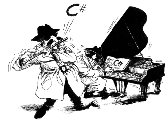

# Import RSA Key

In order to decrypt the credentials you need to provide the private RSA key to [DecryptCredentials] method.
If you have the RSA key in [PEM format], you cannot simply instantiate an [RSA .NET object] from it.
Here we discuss two ways of importing your PEM private key.

## From PEM Format

This is the easier option and recommended **for development time only**.
We can generate an [RSA .NET object] from an RSA Key in PEM format using the [BouncyCastle package].

```bash
dotnet add package BouncyCastle
```

[](http://www.bouncycastle.org/csharp/index.html)

Code snippet here shows the conversion from a PEM file to the needed RSA object.

```c#
// using System.IO;
// using System.Security.Cryptography;
// using Org.BouncyCastle.Crypto;
// using Org.BouncyCastle.Crypto.Parameters;
// using Org.BouncyCastle.OpenSsl;
// using Org.BouncyCastle.Security;

static RSA GetPrivateKey() {
    string privateKeyPem = File.ReadAllText("/path/to/private-key.pem");
    PemReader pemReader = new PemReader(new StringReader(privateKeyPem));
    AsymmetricCipherKeyPair keyPair = (AsymmetricCipherKeyPair) pemReader.ReadObject();
    RSAParameters rsaParameters = DotNetUtilities
        .ToRSAParameters(keyPair.Private as RsaPrivateCrtKeyParameters);
    RSA rsa = RSA.Create(rsaParameters);
    return rsa;
}
```

> **Note**: You don't necessarily need to have a dependency on the [BouncyCastle package] in your bot project.
> The section below offers a better alternative.

## From RSA Parameters

We recommend to JSON-serialize [RSAParameters] of your key and create an RSA object using its values without any
dependency on the [BouncyCastle package] in production deployment.

Copy [EncryptionKeyUtility] and [EncryptionKeyParameters] files from our Quickstart project.
Those help with serialization.

You still need to **use BouncyCastle only once** to read the RSA key in PEM format and serialize its parameters:

```c#
// ONLY ONCE: read the RSA private key and serialize its parameters to JSON
static void WriteRsaParametersToJson() {
    string privateKeyPem = System.IO.File.ReadAllText("/path/to/private-key.pem");
    string json = EncryptionKeyUtility.SerializeRsaParameters(privateKeyPem);
    System.IO.File.WriteAllText("/path/to/private-key-params.json", json);
}

// Now, read the JSON file and create an RSA instance
static RSA GetRsaKey() {
    string json = System.IO.File.ReadAllText("/path/to/private-key-params.json");
    return EncryptionKeyUtility.GetRsaKeyFromJson(json);
}
```

Content of `private-key-params.json` will look similar to this:

```json
{
  "E": "AQAB",
  "M": "0VElW...Fw==",
  "P": "56Mdiw...i7FSwDaM=",
  "Q": "51UN2sd...J44NTf0=",
  "D": "nrXEeOl2Ky...JIQ==",
  "DP": "KZYZWbsy.../lk60=",
  "DQ": "Y25KgzPj...AdBd0=",
  "IQ": "0153...N6Y="
}
```

It's worth mentioning that [EncryptionKeyParameters] is just a copy of [RSAParameters] struct.
There are inconsistencies in serialization of [RSAParameters] type on different .NET platforms
and that's why we use our own [EncryptionKeyParameters] type for serialization.

> For instance, compare `RSAParameters` implementations on [.NET Framework](https://referencesource.microsoft.com/#mscorlib/system/security/cryptography/rsa.cs,21) and [.NET Core](https://github.com/dotnet/corefx/blob/master/src/System.Security.Cryptography.Algorithms/src/System/Security/Cryptography/RSAParameters.cs).

<!-- ----------- -->

[DecryptCredentials]: https://github.com/TelegramBots/Telegram.Bot.Extensions.Passport/blob/master/src/Telegram.Bot.Extensions.Passport/Decryption/IDecrypter.cs
[PEM format]: https://en.wikipedia.org/wiki/Privacy-Enhanced_Mail
[RSA .NET object]: https://docs.microsoft.com/en-us/dotnet/api/system.security.cryptography.rsa?redirectedfrom=MSDN&view=netstandard-2.0
[BouncyCastle package]: https://www.nuget.org/packages/BouncyCastle/
[RSAParameters]: https://docs.microsoft.com/en-us/dotnet/api/system.security.cryptography.rsaparameters?view=netstandard-2.0
[EncryptionKeyUtility]: https://github.com/TelegramBots/Telegram.Bot.Extensions.Passport/blob/master/src/Quickstart/EncryptionKeyUtility.cs
[EncryptionKeyParameters]: https://github.com/TelegramBots/Telegram.Bot.Extensions.Passport/blob/master/src/Quickstart/EncryptionKeyParameters.cs
