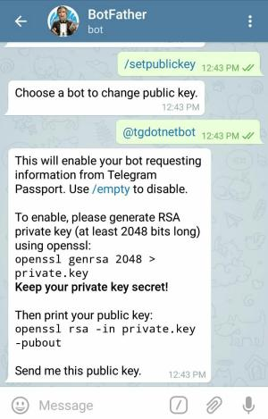
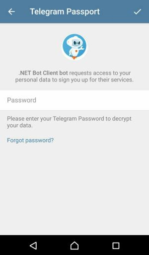
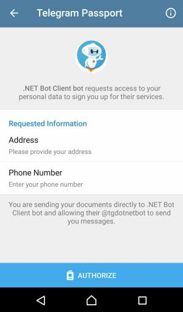
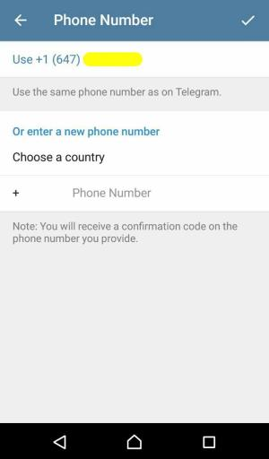
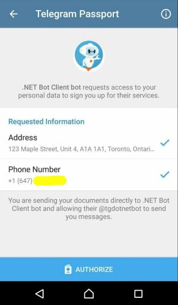
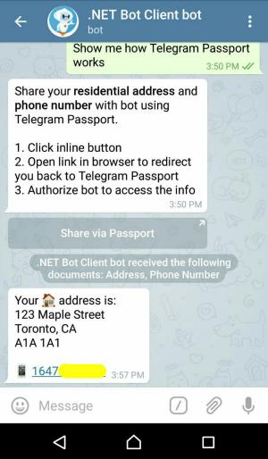

# Telegram Passport - Quickstart

[](https://github.com/TelegramBots/Telegram.Bot.Extensions.Passport/blob/master/src/Quickstart/Program.cs)

This guide teaches the basics of working with Telegram Passport.
See the complete version of the code at [Quickstart project].
Code snippets on this page are in the context of that project.

## Package

[](https://www.nuget.org/packages/Telegram.Bot.Extensions.Passport)

You need to add `Telegram.Bot.Extensions.Passport` extension package to your project
in addition to the core package (`Telegram.Bot`).

⭐️ Star the [Telegram.Bot.Extensions.Passport project] on GitHub 👍

```bash
dotnet add package Telegram.Bot.Extensions.Passport
```

## Encryption Keys

You don't really need to generate any RSA key. Use our sample keys for this demo.
Send the public key to [@BotFather] using `/setpublickey` command:



Copy this public key and send it to BotFather.

```text
-----BEGIN PUBLIC KEY-----
MIIBIjANBgkqhkiG9w0BAQEFAAOCAQ8AMIIBCgKCAQEA0VElWoQA2SK1csG2/sY/
wlssO1bjXRx+t+JlIgS6jLPCefyCAcZBv7ElcSPJQIPEXNwN2XdnTc2wEIjZ8bTg
BlBqXppj471bJeX8Mi2uAxAqOUDuvGuqth+mq7DMqol3MNH5P9FO6li7nZxI1FX3
9u2r/4H4PXRiWx13gsVQRL6Clq2jcXFHc9CvNaCQEJX95jgQFAybal216EwlnnVV
giT/TNsfFjW41XJZsHUny9k+dAfyPzqAk54cgrvjgAHJayDWjapq90Fm/+e/DVQ6
BHGkV0POQMkkBrvvhAIQu222j+03frm9b2yZrhX/qS01lyjW4VaQytGV0wlewV6B
FwIDAQAB
-----END PUBLIC KEY-----
```

Now Telegram client app can encrypt the data for your bot using this key.

## Request Information

Bot waits for a text message from user. Once it receives a text message, it generates an authorization request link
and sends that to the user.

### Authorization Request

[](https://core.telegram.org/passport#request-parameters)

A passport authorization request means that the bot should ask the user to open a `tg://resolve` URI in the browser
with specific parameters in its query string.
You can alternatively have a button in an HTML page on your website for that.

Type [AuthorizationRequestParameters]  helps you in creating such an URI.

```c#
AuthorizationRequestParameters authReq = new AuthorizationRequestParameters(
    botId: 123456, // bot user ID
    publicKey: "...", // public key in PEM format. same as the key above.
    nonce: "unique nonce for this request",
    scope: new PassportScope(new[] { // a PassportScope object
        new PassportScopeElementOne("address"),
        new PassportScopeElementOne("phone_number")
    })
);
```

In [SendAuthorizationRequestAsync] method, we ask for `address` and `phone_number` scopes.
Then, we generate the query string and ask user to open the link.

You might be wondering what is the magic in here?

[https://telegrambots.github.io/Telegram.Bot.Extensions.Passport/redirect.html](https://telegrambots.github.io/Telegram.Bot.Extensions.Passport/redirect.html)

This web page redirects user to `tg://resolve` URI, appending whatever query string was passed to it.

> If a user is using an Android device, the URI will start with `tg:` instead of the default `tg://`.


### Passport Data

You, the user, should now be redirected to the Telegram Passport screen in your Telegram client app.
Enter your password and log in.

> Note that the app will ask you to register if this is the first time you are using Telegram Passport.



Fill in the _address_ and _phone number_ data. Click on the _Authorize_ button at the end.






At this point, your Telegram client app encrypts the actual Telegram Passport data (e.g. address) using the
AES algorithm, and then encrypts the info required for decryption using your bot's public RSA key.
Finally, it sends the result of both encryptions to Telegram servers.

### Data Decryption

[](https://core.telegram.org/bots/api#passportdata)

Your bot now receives a new message update with the encrypted Passport data. The user is also notified in the chat:


Let's decrypt that gibberish to get the information. That's what [DecryptPassportDataAsync] method does.

#### Step 1: Credentials

[](https://core.telegram.org/bots/api#encryptedcredentials)
[](https://core.telegram.org/passport#credentials)

You can't just access the encrypted data in the `message.passport_data.data` array.
Required parameters for their decryption are in the `message.passport_data.credentials` object.
But that credentials object is encrypted using bot's public key!

We first take the bot's _private key_ this time and decrypt the credentials.

> There are more details about importing a key in PEM format on the [RSA Key page].

```c#
IDecrypter decrypter = new Decrypter();
Credentials credentials = decrypter.DecryptCredentials(
    message.PassportData.Credentials, // EncryptedCredentials object
    GetRsaPrivateKey() // private key as an RSA object
);
```

#### Step 2: Nonce

[](https://core.telegram.org/passport#credentials)
[](https://core.telegram.org/passport#request-parameters)

There is a `nonce` property on the credentials (now decrypted) object.
In order to prevent certain attacks, ensure its value is exactly the same as the nonce you set in the authorization request.
Read more about [nonce on Wikipedia].

#### Step 3: Residential Address

[](https://core.telegram.org/bots/api#encryptedpassportelement)
[](https://core.telegram.org/passport#residentialaddress)

[](https://core.telegram.org/passport#securedata)
[](https://core.telegram.org/passport#securevalue)
[](https://core.telegram.org/passport#datacredentials)

It's finally time to see the user's address.
We are looking for an encrypted element with type of _address_ in `message.passport_data.data` array.
Also, decryption parameters for that are in `credentials.secure_data.address.data`.
Here is how the decryption magic happens:

```c#
EncryptedPassportElement addressElement = message.PassportData.Data.Single(
    el => el.Type == PassportEnums.Scope.Address
);
ResidentialAddress address = decrypter.DecryptData<ResidentialAddress>(
    encryptedData: addressElement.Data,
    dataCredentials: credentials.SecureData.Address.Data
);
```

[DecryptData] method does 3 tasks here:

1. Decrypts the data into a JSON-serialized string
1. Verifies that the data hashes match
1. Converts from JSON to a .NET object

#### Step 4: Phone Number

[](https://core.telegram.org/bots/api#encryptedpassportelement)

Values for phone number and email address are not end-to-end encrypted in Telegram Passport and
Telegram stores these values after being verified.

There is no need for decryption at this point.
Just find the element with the type of _phone\_number_ in the `message.passport_data.data` array.

### Information Demo

At the end, bot sends some of the information received to the user for demo purposes.



<!-- ----------- -->

[Quickstart project]: https://github.com/TelegramBots/Telegram.Bot.Extensions.Passport/tree/master/src/Quickstart
[Telegram.Bot.Extensions.Passport project]: https://github.com/TelegramBots/Telegram.Bot.Extensions.Passport
[@BotFather]: https://t.me/BotFather
[AuthorizationRequestParameters]: https://github.com/TelegramBots/Telegram.Bot.Extensions.Passport/blob/master/src/Telegram.Bot.Extensions.Passport/Request/AuthorizationRequestParameters.cs
[SendAuthorizationRequestAsync]: https://github.com/TelegramBots/Telegram.Bot.Extensions.Passport/blob/master/src/Quickstart/Program.cs
[DecryptPassportDataAsync]: https://github.com/TelegramBots/Telegram.Bot.Extensions.Passport/blob/master/src/Quickstart/Program.cs
[RSA Key page]: key.md
[nonce on Wikipedia]: https://en.wikipedia.org/wiki/Cryptographic_nonce
[DecryptData]: https://github.com/TelegramBots/Telegram.Bot.Extensions.Passport/blob/master/src/Telegram.Bot.Extensions.Passport/Decryption/IDecrypter.cs
