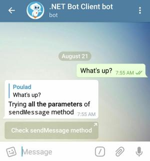

# Text Messages and More

Text is a powerful interface for your bot. [`sendMessage`] is probably the most used method of Bot API.

Code snippet here assumes you are using the event handler of Example Bot page. The message sent looks like this
picture:



```c#
// using Telegram.Bot.Types;
// using Telegram.Bot.Types.Enums;
// using Telegram.Bot.Types.ReplyMarkups;

Message message = await botClient.SendTextMessageAsync(
  chatId: e.Message.Chat,
  text: "Trying *all the parameters* of `sendMessage` method",
  parseMode: ParseMode.Markdown,
  disableNotification: true,
  replyToMessageId: e.Message.MessageId,
  replyMarkup: new InlineKeyboardMarkup(InlineKeyboardButton.WithUrl(
    "Check sendMessage method",
    "https://core.telegram.org/bots/api#sendmessage"
  ))
);
```

Method `SendTextMessageAsync` of .NET Bot Client maps to [`sendMessage`] on Telegram Bot API. This method sends a
text message and returns the message object sent.

`text` is written in [MarkDown format] and `parseMode` indicates that. You can also try writing in HTML or plain text.

<!-- By `disableNotification`  -->

[`sendMessage`]: https://core.telegram.org/bots/api#sendmessage
[MarkDown format]: https://en.wikipedia.org/wiki/Markdown